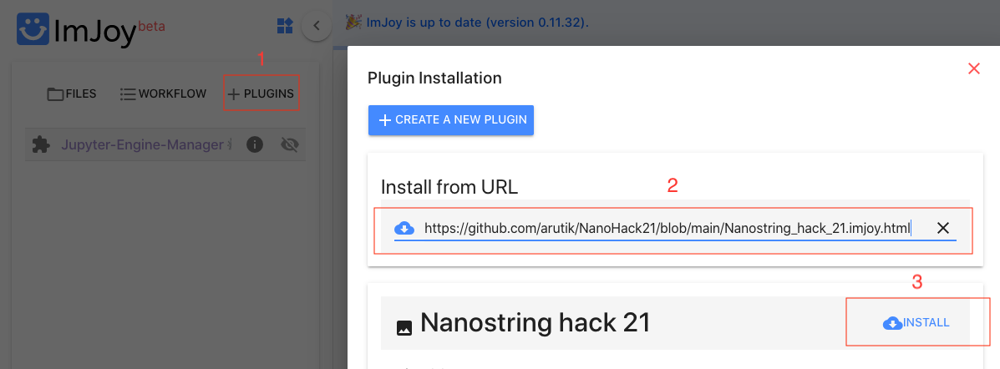
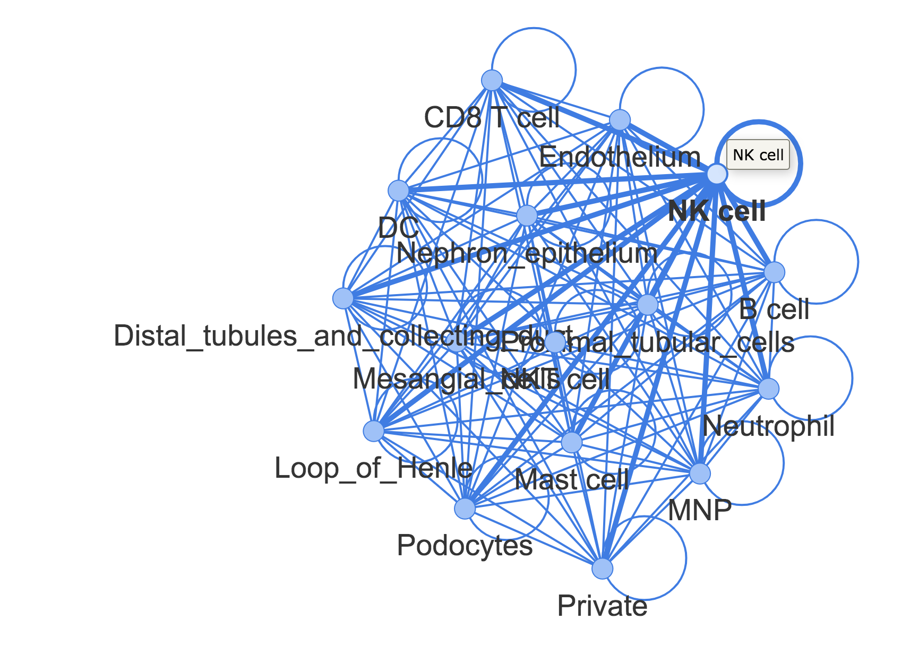
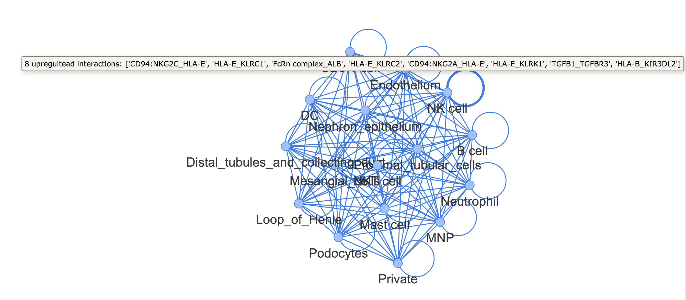

# NanoHack21
NanoString Spatial Omics Hackathon 2021

Our solution offers a flexible analysis and interactive visulisation workflow for exploration of the NanoString GeoMx® Digital Spatial Profiler data.
Here we demonstrate it on the NanoString GeoMx® human kidney dataset in conjunction with the publicly available signle cell RNA sequencing (scRNA-seq) reference dataset of human kidney from [Young et al., Science 2018](https://science.sciencemag.org/content/361/6402/594.editor-summary). This approach can also be used for other such datasets.

The solution consists of:
1. Unbiased analysis of the NanoString GeoMx® whole transcriptome dataset
2. Interactive web-based visualisation of the NanoString GeoMx® dataset
3. Analysis and interactive visualisation of the dysregulation of cell-cell communication networks in context of kidney disease

To perform the analyses included in this solution, the user will need to have the following files on hand:
- NanoString GeoMx® human kidney dataset from [here](http://nanostring-public-share.s3-website-us-west-2.amazonaws.com/) (or other NanoString GeoMx® dataset)
- Signle cell RNA sequencing (scRNA-seq) reference dataset of human kidney from [Young et al., Science 2018](https://science.sciencemag.org/content/361/6402/594.editor-summary) (or other scRNA-seq reference dataset)

# Prerequisite
## Creating conda env

**conda env create -f environment.yml**

to install the kernel into your Jupyter notebook

**python -m ipykernel install --user --name nanostring-hack-2021 --display-name "Nanostring Hack 2021"**

## 1. Data preparation
### 1.1 Image data preprocessing

For better user experience when browsing the image data, all ROI images (.png) were first downsampled by a factor of 4 in each dimension. These downsampled images were then uploaded to our temporary server (https://nanohack21storage.blob.core.windows.net) for this hackathon. Ideally the image data should be hosted on servers such as Bioimage Archive (https://www.ebi.ac.uk/bioimage-archive/). In that case, no data compression is needed.

### 1.2 UMAP generation

Based on transcriptomic data, we have generated both 2D and 3D UMAPs using Scanpy (https://scanpy.readthedocs.io/en/stable/) and Anndata (https://anndata.readthedocs.io/en/latest/) packages in Python (see details in `Analysis/1_transcriptome_analysis.ipynb`). For all dots in the UMAP, their corresponding image names are saved as a column inside the csv files (2D and 3D). These CSV files are in the `data` directory and wil be read remotely by our ImJoy plugin.

## 2. ImJoy plugin

Interactive data exploration will largely facilitate, or even change the way we interpret the data. Especially for imaging datas from microscopes, the extracted tabular datas often don’t capture all information and may lead to biased interpretation. Making raw data easily browsable along with other statistical analysis is the way to avoid such pitfalls. To make that possible, we have developed an ImJoy plugin to not only visualize the UMAP that was generated from the transcriptomics data, but also to visually assess the microscopy images associated with each entry.

### Demo

In order to run our plugin, first, you need to go the ImJoy website (https://imjoy.io/#/) and select the `start imjoy` button.
Once in the ImJoy app interface:

1. Click on `+ PLUGINS` section
2. Add the path to our plugin (https://github.com/arutik/NanoHack21/blob/main/Nanostring_hack_21.imjoy.html) and Tape `enter`
3. Click on `install` in the prompted plugin description below.

Once installed, click on the plugin name to lanuch it. By default, it will create an Mybinder server and use it as the backend.
PS: the CSVs we generated and the images associated are hosted on our personal servers and the URLs are hard coded into the code. So you don't have to upload.

## 3. Cell-cell communication analysis

Using [CellPhoneDB](https://www.cellphonedb.org/)

CellPhoneDB is a publicly available repository of curated receptors (R), ligands (L) and their interactions.

Here we implement an approach adapted for NanoString GeoMx® Digital Spatial Profiler data. To correctly infer expression of genes encoding ligands and receptors in cell types present in the NanoString human kidnet dataset, we use it in conjunction with a publicly accessible signle cell RNA sequencing (scRNA-seq) reference dataset from [Young et al., Science 2018](https://science.sciencemag.org/content/361/6402/594.editor-summary) of human kidney that has been prior used to perform cell type deconvolution of each NanoString region of interest (ROI) by NanoString team.

The proposed pipeline consists of the following steps:
1. Preparing files containing manually curated L/R interactions (notebook S0)
2. Generating the CellPhone database (notebook S1)
3. Preparing the signle cell RNA sequencing (scRNA-seq) dataset for CellPhoneDB (notebook S2)
4. Extracting all interactions from the scRNA-seq reference dataset (notebook S3)
5. Performing differential expression (DE) analysis of the NanoString ROIs (notebook S4)

    (here the user can focus on a particular comparison of interest, in this demonstrative workflow we compare abnormal and healthy glomeruli, as annotated by pathology in NanoString dataset, to explore potential dysregulation of cell-cell communication networks in abnormal glomeruli)

6. Intersecting the DE genes from (5) with all possible interactions between cell types colocated in space as inferred from prior cell type deconvolution of each NanoString ROI using scRNA-seq reference dataset (notebook S5)
7. Visualising results and producing HTML files with interactive cell-cell communication networks for user to explore (notebook S6)

This workflow is conveniently packaged into one master notebook `Analysis/3_Cell-cell_comm_analysis/1_Master_notebook_cellphone_workflow.ipynb` that performs all these steps easily. 
To play with the parameters and modify certain steps of the workflow, the user is welcome to have a look at each notebook individually and make changes.

To explore cell-cell communication networks dysregulated in abnormal glomeruli when compared to healthy glomeruli, we are producing conventional tabular data (as can be seen in  `Analysis/3_Cell-cell_comm_analysis/2_Visualisation.ipynb` notebook where the user can specifically have a look at interactions between particular cell types of interest) and, for a more visual experience, we generate interactive HTML files for communication events up- and downregulated in abnormal glomeruli which can be found via following links: 

(simply open one of these interactive HTML files in your browser and click on an edge connecting cell types of interest to see dysregulated communication events)

- Interaction network of communication events upregulated in abnormal glomeruli - [here](https://github.com/arutik/NanoHack21/blob/main/Analysis/3_Cell-cell_comm_analysis/nx_upreg.html)
- Interaction network of communication events downregulated in abnormal glomeruli - [here](https://github.com/arutik/NanoHack21/blob/main/Analysis/3_Cell-cell_comm_analysis/nx_downreg.html)

You can highlight a network of communication events that involves a certain cell type by clicking the node with that cell type in the title like so:

You can also clink on a specific edge connecting a pair of cell types and view the dysregulated interactions like so:

____________________________________________________________________________________________________________________________________________________________________

Our approach offers a user-friendly analysis and visualisation workflow that has flexibility in choice of parameters and helps explore and understand the data better to facilitate exciting biological discoveries. 
